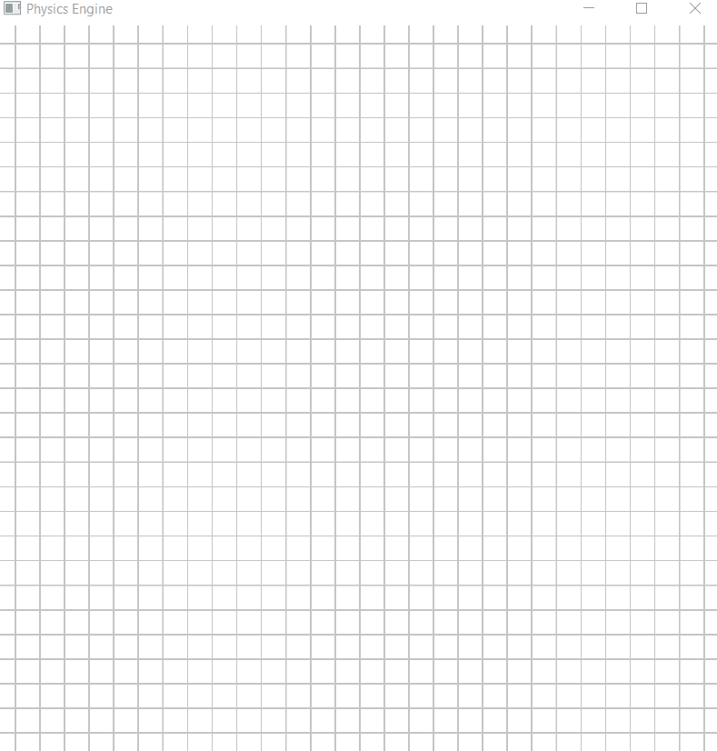

# OpenGLPhysics
This is a (work in progress) OpenGL project that should contain all kinds of physics. Currently, only a basic type of collision detection and response is implemented. 

To Run the Project, you can run the .exe in the Build folder.

## Demo

## References
- [Learn OpenGl](https://learnopengl.com/)
- [Easy Physics Engine, Verlet Integration](https://www.youtube.com/watch?v=lS_qeBy3aQI)